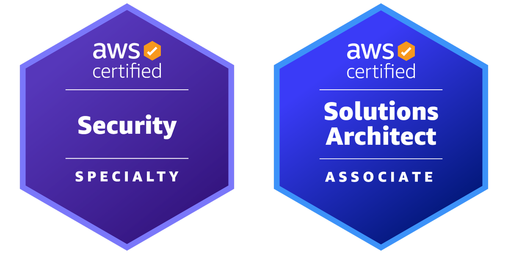

## Hi there 👋

## About Me
- Freelance dev with 7 years of hands-on experience.
- Passionate about building reliable systems and solving real-world problems.
- When I'm not coding, you'll find me fishing or at the stadium watching football.

## Things I code with

## AWS Certifications

## Contributions

